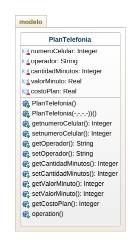

# PlanTelefonia

Realice el análisis (identificación de clases, atributos y métodos)
Diseño (diagrama de clases) y construcción  (patrón mvc) de la siguiente situación :
Se desea gestionar un plan de telefonía móvil 
El plan tiene un numero de celular , un operador , una cantidad de minutos y un costo por minuto
Calcular el total a pagar teniendo en cuenta que si el operador es  “WOM” tiene un 50% de descuento usar mínimo 2 métodos constructores

## Diagrama de clases
